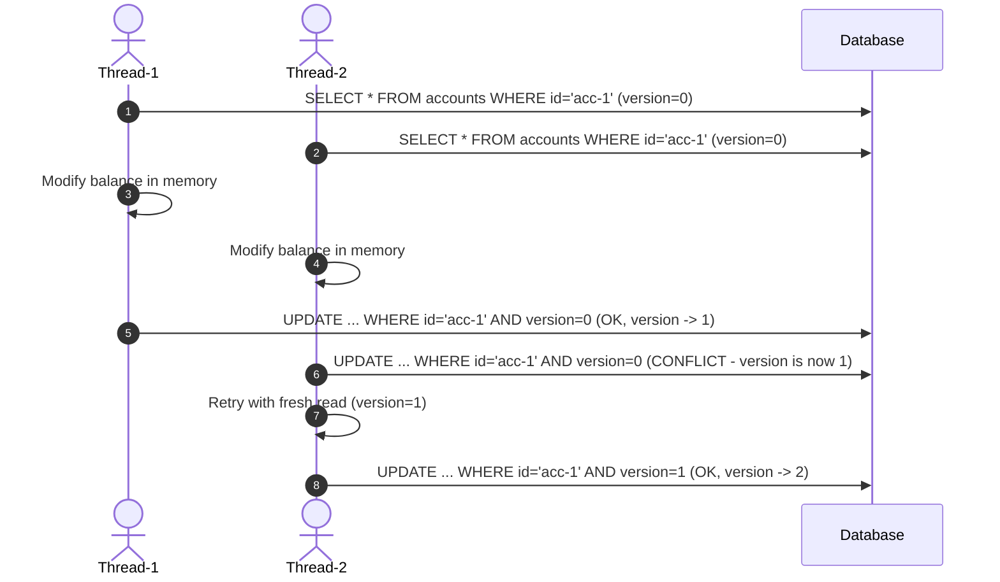
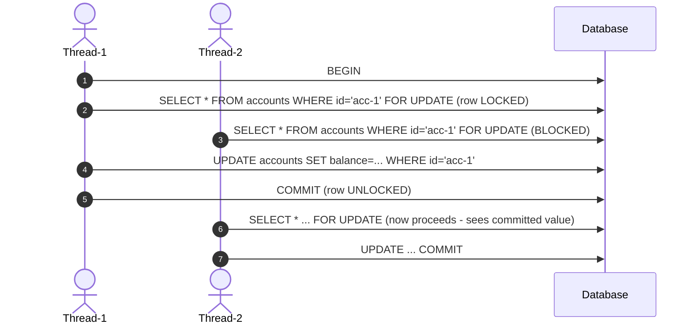
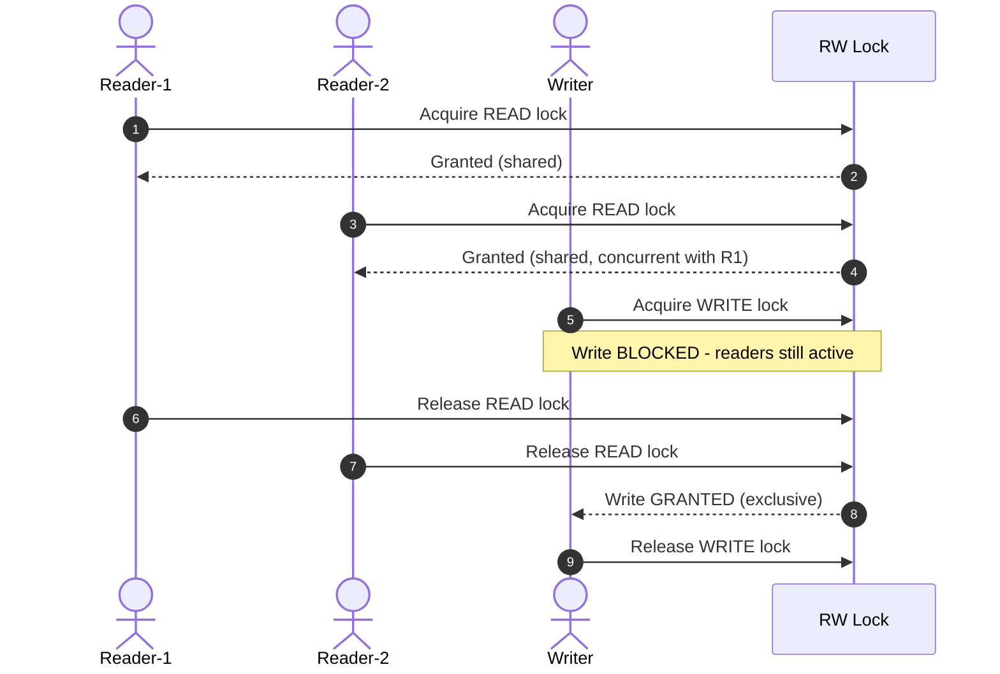
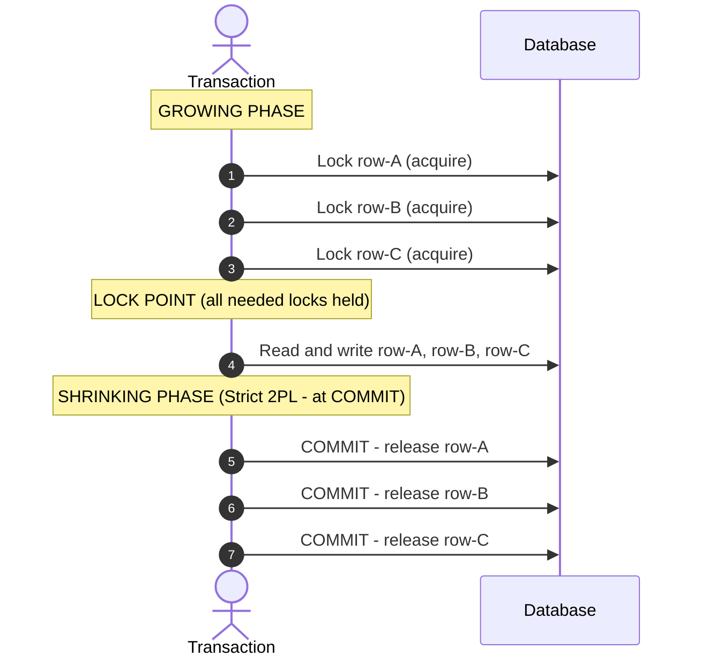
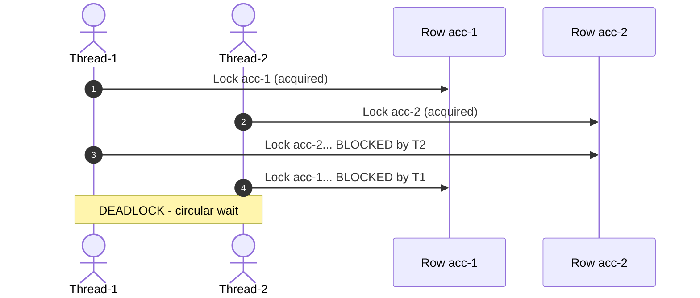
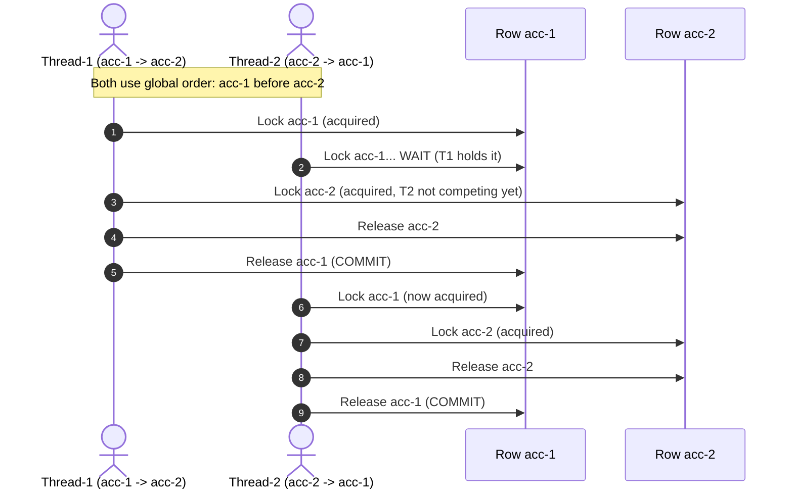
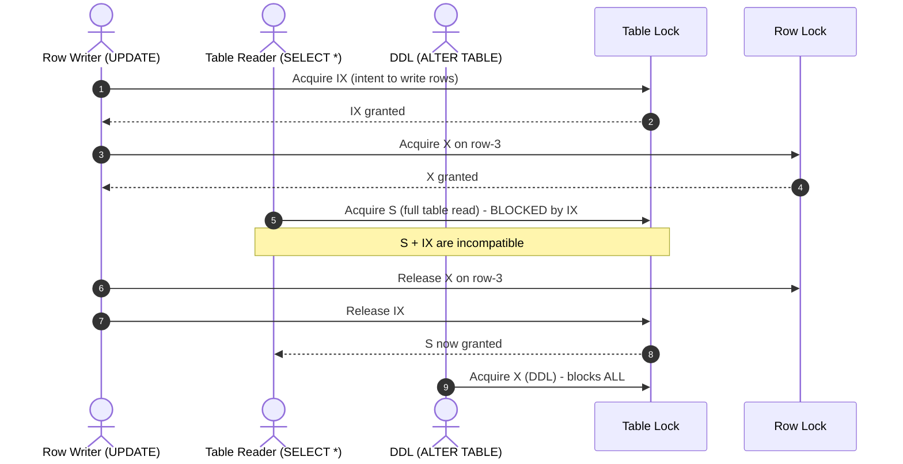

# Database Locking in System Design (Core Java)

A complete, runnable reference covering every major database locking mechanism —
from Optimistic and Pessimistic locking through Read/Write locks, Two-Phase Locking,
Deadlock scenarios, and the Intent Lock hierarchy used inside real engines like InnoDB.

---

## Table of Contents
1. [Overview](#1-overview)
2. [Project Structure](#2-project-structure)
3. [Optimistic Locking](#3-optimistic-locking)
4. [Pessimistic Locking](#4-pessimistic-locking)
5. [Read / Write Lock](#5-read--write-lock-shared-vs-exclusive)
6. [Two-Phase Locking (2PL)](#6-two-phase-locking-2pl)
7. [Deadlock — Simulation and Prevention](#7-deadlock--simulation-and-prevention)
8. [Intent Locks (IS / IX / S / X)](#8-intent-locks-is--ix--s--x)
9. [Lock Comparison Matrix](#9-lock-comparison-matrix)
10. [Running the Project](#10-running-the-project)

---

## 1. Overview

A **database lock** controls concurrent access to shared data so that
transactions produce correct, consistent results even when many threads
or clients operate simultaneously.

### Why locking matters
Without locks, concurrent transactions cause:

| Anomaly | Description |
| :--- | :--- |
| **Dirty Read** | Reading uncommitted data from another transaction |
| **Lost Update** | Two writers overwrite each other's changes |
| **Non-repeatable Read** | Same SELECT returns different rows within one transaction |
| **Phantom Read** | New rows appear between two identical range queries |

---

## 2. Project Structure

```
Database-Locking/
├── pom.xml
└── src/main/java/com/example/locking/
    ├── Main.java                          Entry point — runs all demos
    ├── model/
    │   ├── Account.java                   Bank account row (id, owner, balance, version)
    │   └── Product.java                   Product inventory row (id, name, stock, version)
    ├── db/
    │   └── InMemoryDatabase.java          Simulated DB engine with row and table locks
    └── locks/
        ├── OptimisticLock.java            Version-based conflict detection
        ├── PessimisticLock.java           SELECT FOR UPDATE row locking
        ├── ReadWriteLockDemo.java         Shared reads / exclusive writes
        ├── TwoPhaseLock.java              Growing + shrinking phase (Strict 2PL)
        ├── DeadlockDemo.java              Deadlock simulation + prevention
        └── IntentLockDemo.java            IS / IX / S / X InnoDB-style hierarchy
```

---

## 3. Optimistic Locking

**Philosophy:** "Conflicts are rare — read freely, validate before writing."

No lock is held while the application reads and modifies data.
A `version` column detects whether another transaction changed the row during our work.



**SQL equivalent (JPA `@Version`):**
```sql
UPDATE accounts
SET balance = ?, version = version + 1
WHERE id = ? AND version = ?   -- 0 rows affected = conflict
```

- **Java Source:** [`OptimisticLock.java`](src/main/java/com/example/locking/locks/OptimisticLock.java)
- **Best for:** Read-heavy workloads, HTTP APIs, distributed systems.
- **Worst for:** High write contention (too many retries degrade throughput).

---

## 4. Pessimistic Locking

**Philosophy:** "Conflicts are likely — lock the row before reading it."

The row is locked the moment it is read. Other transactions wanting the same row
block until the lock is released at COMMIT or ROLLBACK.



**SQL equivalent:**
```sql
BEGIN;
SELECT * FROM accounts WHERE id = ? FOR UPDATE;   -- acquires X row lock
UPDATE accounts SET balance = ? WHERE id = ?;
COMMIT;                                            -- releases lock
```

- **Java Source:** [`PessimisticLock.java`](src/main/java/com/example/locking/locks/PessimisticLock.java)
- **Best for:** High-contention writes (financial transactions, ticket booking).
- **Worst for:** Long transactions; can cause deadlocks without careful lock ordering.

---

## 5. Read / Write Lock (Shared vs Exclusive)

**Philosophy:** "Readers don't block each other — only writers need exclusivity."

| Operation | Lock Mode | Concurrent with |
| :--- | :--- | :--- |
| SELECT | S (Shared) | Other S locks |
| INSERT / UPDATE / DELETE | X (Exclusive) | Nothing |



- **Java Source:** [`ReadWriteLockDemo.java`](src/main/java/com/example/locking/locks/ReadWriteLockDemo.java)
- **Best for:** Read-heavy systems (product catalogs, news feeds, config reads).
- **Worst for:** Write-heavy workloads where writers constantly queue.

**Lock upgrade (read -> write):**
Java's `ReentrantReadWriteLock` does NOT support direct upgrade (would deadlock).
Safe pattern: release read lock -> re-acquire write lock -> re-read data.

---

## 6. Two-Phase Locking (2PL)

**Philosophy:** "Acquire ALL locks before releasing ANY."

The protocol that real databases (InnoDB, PostgreSQL, SQL Server) use internally
to guarantee serializability — the gold standard of transaction isolation.



**2PL Variants:**

| Variant | When locks are released | Notes |
| :--- | :--- | :--- |
| Basic 2PL | During transaction (after lock point) | Can cause cascading rollbacks |
| Strict 2PL | At COMMIT / ROLLBACK only | Most common - used by InnoDB |
| Rigorous 2PL | All locks held until commit | Strictest, no cascading aborts |
| Conservative 2PL | All locks acquired upfront before work starts | Deadlock-free but impractical |

- **Java Source:** [`TwoPhaseLock.java`](src/main/java/com/example/locking/locks/TwoPhaseLock.java)

---

## 7. Deadlock — Simulation and Prevention

**What is a deadlock?**
Thread-1 holds lock-A and waits for lock-B.
Thread-2 holds lock-B and waits for lock-A.
Neither can proceed — circular wait.



### Prevention Strategy A: Lock Ordering

Always acquire locks in the same global order (e.g. alphabetical row ID).
If both threads lock the lower ID first, circular wait is mathematically impossible.



### Prevention Strategy B: Timeout

If a lock cannot be acquired within N ms, abort and retry with back-off.
Mirrors MySQL's `innodb_lock_wait_timeout` (default 50 seconds).

- **Java Source:** [`DeadlockDemo.java`](src/main/java/com/example/locking/locks/DeadlockDemo.java)

---

## 8. Intent Locks (IS / IX / S / X)

**Philosophy:** "Announce your row-level intentions at the table level to avoid O(n) compatibility checks."

Used internally by InnoDB, SQL Server, DB2 to coordinate row-level and table-level operations efficiently.

### Lock Hierarchy

```
TABLE LEVEL:   IS      IX      S       X
               |       |       |       |
ROW LEVEL:   S-row   X-row   (all)   (all)
```

### Compatibility Matrix

|        | IS held | IX held | S held | X held |
| :---   | :---:   | :---:   | :---:  | :---:  |
| **IS** | OK      | OK      | OK     | WAIT   |
| **IX** | OK      | OK      | WAIT   | WAIT   |
| **S**  | OK      | WAIT    | OK     | WAIT   |
| **X**  | WAIT    | WAIT    | WAIT   | WAIT   |



**Common scenarios:**

| SQL Operation | Table Lock | Row Lock |
| :--- | :--- | :--- |
| `SELECT ... WHERE id=1` | IS | S |
| `UPDATE ... WHERE id=1` | IX | X |
| `SELECT *` (full scan) | S | - |
| `ALTER TABLE` | X | - |

- **Java Source:** [`IntentLockDemo.java`](src/main/java/com/example/locking/locks/IntentLockDemo.java)

---

## 9. Lock Comparison Matrix

| Lock Type | Who can read | Who can write | Hold time | Deadlock risk | Best use case |
| :--- | :--- | :--- | :--- | :--- | :--- |
| **Optimistic** | Everyone (no lock) | One at a time (version check) | Zero | None | Read-heavy, HTTP APIs |
| **Pessimistic** | Blocked by writer | One at a time | Transaction duration | Medium | High-contention writes |
| **Read (S)** | Many concurrent | Blocked | Until read done | Low | Reporting, catalog reads |
| **Write (X)** | Blocked | One at a time | Until write done | Medium | Any mutation |
| **Strict 2PL** | Blocked by writers | Serialized | Until COMMIT | Medium | Multi-row transactions |
| **Intent IS** | Many concurrent | Row-level OK | Until row read done | Low | Row SELECT in shared DB |
| **Intent IX** | Table S blocked | Row-level concurrent | Until row write done | Low | Row UPDATE in shared DB |
| **Table X** | All blocked | All blocked | DDL duration | High | Schema migrations |

---

## 10. Running the Project

### Requirements
- Java 17+
- Maven 3.8+
- No external services needed (pure in-memory simulation)

### Run
```powershell
# Compile and run all demos
mvn compile exec:java -Dexec.mainClass="com.example.locking.Main"
```

### Expected output sections
```
============================================================
  1. OPTIMISTIC LOCKING
============================================================
  2. PESSIMISTIC LOCKING
  3. READ / WRITE LOCK (Shared vs Exclusive)
  4. TWO-PHASE LOCKING (2PL - Strict)
  5. DEADLOCK - Simulation and Prevention
  6. INTENT LOCKS (IS / IX / S / X)
============================================================
  ALL DEMOS COMPLETE
============================================================
```
